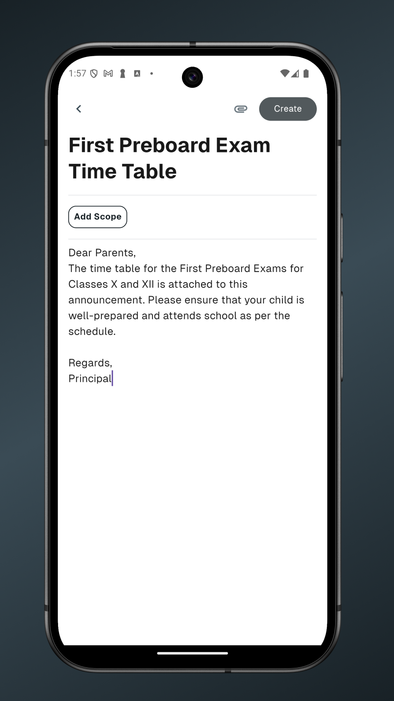
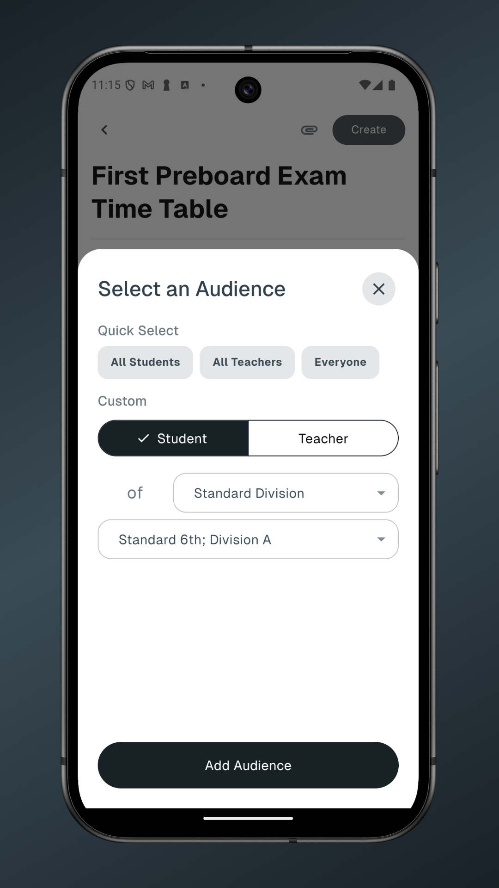
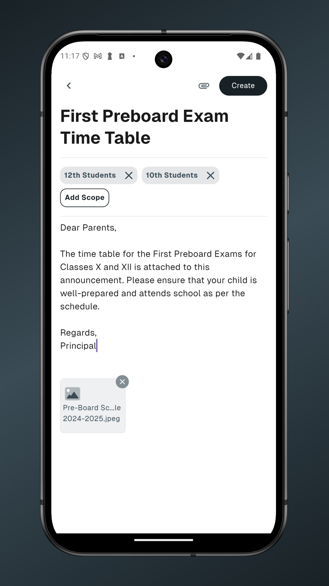
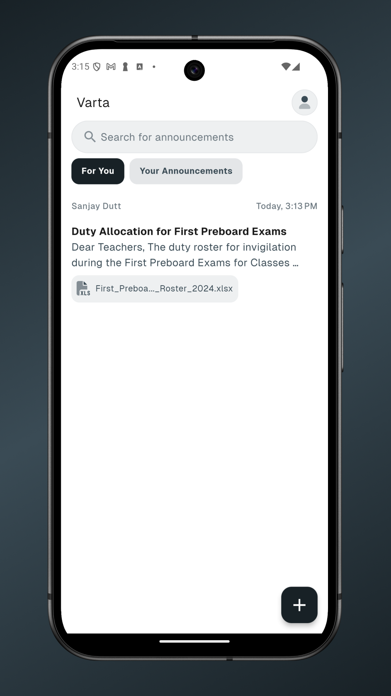
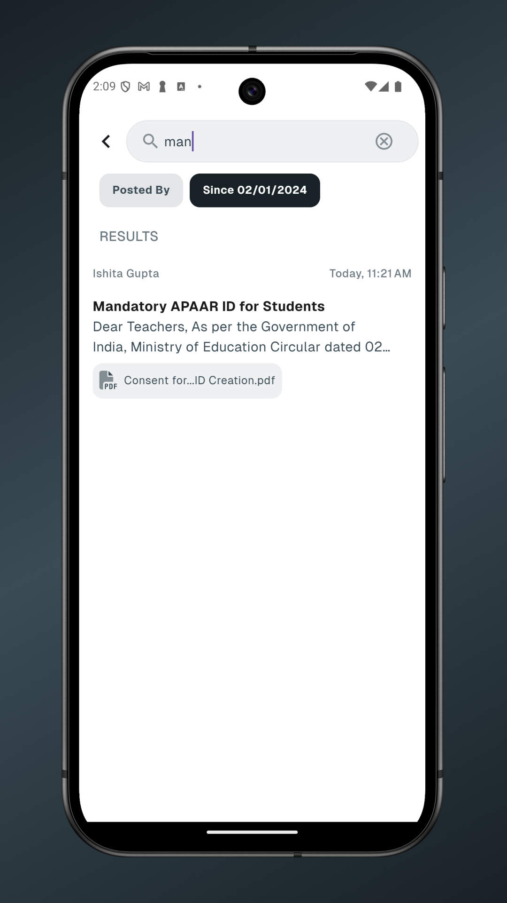

    
    <h1 align="center">Varta</h1>
  </a>

    WhatsApp isn't built for one-way multi-channel school comunications. We Are.

## Introduction

School communications are often highly fragmented, with not every piece of communication being relevant to everyone. As a result, students—and even more so, teachers—find themselves juggling multiple small WhatsApp groups with varying levels of relevance and activity. This leads to sifting through a lot of irrelevant information just to find important announcements.

Varta addresses this by implementing scoped announcements built on top of a rich user identity system. When creating an announcement, a teacher can specify the exact audience it should reach. For instance, an announcement intended for all subject teachers of 9th, 10th, and 11th standards will be visible ONLY to those teachers, ensuring no one else receives it.

## Features

- Password-less SMS and Email based OTP Login
- instant Push Notifications
- Live incremental updates
- Scoped Announcement 
    - [x] Attachments
    - [x] Multi-parameter search
    - [ ] Scheduled Announcements (Planned) 
    - [ ] Priority-Based Filtering (Planned) 
- Web Support

## Screenshots

<table style="border-collapse: collapse;">
    <tr>
        <td style="padding: 5px;">
            
        </td>
        <td style="padding: 5px;">
            
        </td>
    </tr>
    <tr>
        <td style="padding: 5px;">
            
        </td>
        <td style="padding: 5px;">
            
        </td>
    </tr>
    <tr>
        <td style="padding: 5px;">
            
        </td>
    </tr>
</table>

If you're interesting in adopting 
**Varta** for your organization or specific use-case, feel free to reach out to me at [aadv1k@outlook.com](mailto:aadv1k@outlook.com). I'll get back to to you as soon as I can! 

## Documentation

### See [`server/README.md`](./server/README.md) for back-end specific documentation

### See [`app/README.md`](./app/README.md) for App/UI specific documentation

## Credits

- The font used is [Geist Sans by Vercel](https://vercel.com/font)

- [Popsy.co](https://popsy.co/illustrations) for the beautiful illustrations and graphics