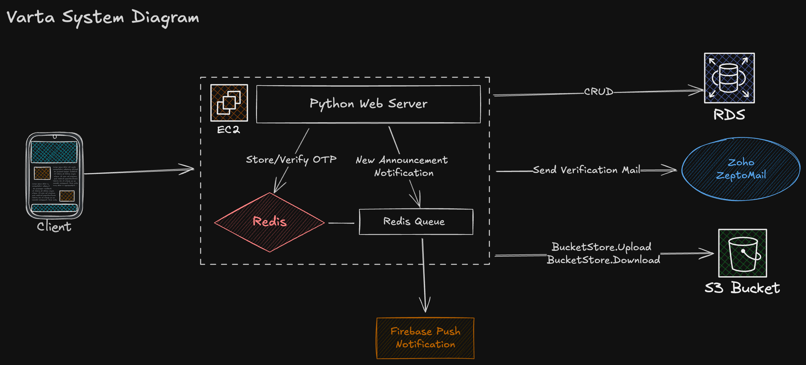

# Varta Server



- [🔨 Self-hosting Guide](#self-hosting-guide)
- [Configuration](#configuration)

## Self-hosting Guide

You first need to accquire certain environment variables see [`.env.example`](./.env.example)

```properties
DB_HOST=""
DB_PORT="5432"
DB_PASSWORD=""
DB_NAME=""
DB_USER=""

# https://www.zoho.com/zeptomail/help/api/email-sending.html
ZEPTOMAIL_TOKEN="<ZeptoMail Token>"
ZEPTOMAIL_FROM_ADDRESS="<ZeptoMail Domain>"

# These allow you to bypass the OTP verification and prevent wasting email / sms calls.
ADMIN_MASTER_OTP = "000000"
ADMIN_EMAILS = "foo@example.com, bar@example.com"

GOOGLE_APPLICATION_CREDENTIALS=".firebase/service-account.json"
```

To accquire the `.firebase/service-account.json` you can see [Create and delete service account keys](https://cloud.google.com/iam/docs/keys-create-delete).

Once you've set all the variables, you should first load all the data from the fixtures (if you are running for the first time)

```shell
python manage.py loaddata initial_classrooms initial_academic_year initial_departments
```

> **NOTE** this is important. If you don't run this unexpected errors may occur

Finally the server provides a [`compose.yml`](./compose.yml), which will run a local redis instance, start the RQ worker in the background and run the 

```yml
name: varta-server
services:
  redis-cache:
    image: "redis:alpine"
    ports:
      - "6379:6379"
  server: 
    build:
      context: .
    command: sh -c "python manage.py start_rq_worker & python manage.py runserver 0.0.0.0:8000"
    depends_on: 
      - redis-cache
    ports:
      - "8000:8000"
    environment:
      REDIS_HOST: redis-cache
      REDIS_PORT: "6379"
      FIREBASE_SERVICE_ACCOUNT_JSON: ${FIREBASE_SERVICE_ACCOUNT_JSON}
    volumes:
      - ${FIREBASE_SERVICE_ACCOUNT_JSON}:/varta-server/.firebase/service-account.json
```

Once you have all this, you can simply run the following command to run everything within a vps.

```shell
FIREBASE_SERVICE_ACCOUNT_JSON=/path/to/your/service-account.json
docker compose -f ./compose.yml --env-file /path/to/env up
```

## Configuration

All configuration is done through [`config/setting.py`](./config/settings.py)

- `OTP_EXPIRY_IN_SECONDS`
- `OTP_LENGTH` 
- `ADMIN_EMAILS`: a list of emails, that when logged in through an email won't be sent to them
- `ADMIN_MASTER_OTP`: if the email is in `ADMIN_EMAILS` and the master OTP is provided the user can login without OTP verification
- `FCM_DEVICE_TOKEN_EXPIRY_IN_DAYS`: controls the firebase devce token expiry, used for sending push notifications.
- `MAX_UPLOAD_FILE_SIZE_IN_BYTES` controls the maximum file size of inidividual attachment
- `MAX_UPLOAD_QUOTA_PER_ANNOUNCEMENT_IN_BYTES` controls the collective size of all attachments per announcement. (Eg 4 25mb attachments OR a single 100mb attachment)
- `MAX_ATTACHMENTS_PER_ANNOUNCEMENT` 